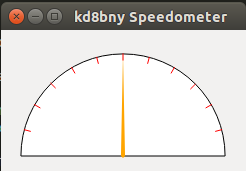

#pyqtWidgets
This is a fork from [github](https://github.com/Fapiko/pyqt-testwidget). The purpose was to create custom qt4 widgets to use in future projects. Starting with [pi2go](https://github.com/kd8bny/pi2go).

##Instructions
After cloning the repo start make sure you have the required prerequisites by running:

	make prereq

Then you can start qt4-designer by running:

	$make install

In the future this will move the widget classes to qt designer.

To update the widgets if needed run:

	$make update

Finally if you wish to see the widget first run:

	$make run

##Widgets
###Speedometer

This first widget in the collection is a speedometer. At this moment there is only a single function *updateValue* which takes an integer. 

	speedowidget.updateValue(int)

Each of the tick marks are equivalent to 10mph in a range from 0<value<120. kph is to come and is still accepted.
